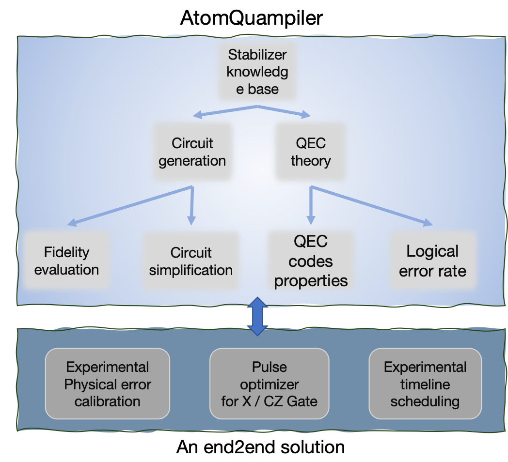

# AtomQuampiler - Bridging the Quantum Compilation Gap


## Overview

In neutral atom quantum computers, there exists a massive "compilation gap" between high-level scientific objectives (such as implementing a quantum error correction code) and the ability to generate efficient, high-fidelity physical control instructions that can run on real hardware. **AtomQuampiler** is designed as an intelligent, automated solution to bridge this gap.

AtomQuampiler constructs a complete, full-stack compilation and optimization pipeline. Users simply input a quantum error correction code in natural language, and AtomQuampiler initiates an intelligent workflow composed of multiple MCP tools:

## Core Workflow

### 1. **Quantum Error Correction Code Knowledge Retrieval & Performance Analysis**
- Generate comprehensive introductions to quantum error correction codes
- Create quantum circuits and simulate quantum code error correction cycles
- Implement decoder-based quantum code distance analysis

### 2. **AI-Driven Circuit Generation**
- Utilize reinforcement learning to explore and generate efficient logical quantum state encoding circuits
- Perform multi-dimensional comparison (fidelity, gate count) with traditionally generated circuits
- Apply optimization functions to simplify the optimal circuits

### 3. **Hardware-Aware Co-Design**
- Analyze and calibrate real hardware noise characteristics from simulated experimental data
- Extract physical parameters (gate fidelity, SPAM errors) and feed them back to upper layers
- Enable more accurate quantum circuit evaluation

### 4. **End-to-End Physical Layer Optimization**
- After selecting the optimal logical circuit, dive deeper into the physical layer
- Complete pulse design, execute timing planning, and generate final physical control instructions

## Features

### Pulse‑Level Optimization (`src/gate_optimize/pulse/`)
- **CZ gate (GRAPE)**: Bidirectional evolution, live pulse shape/fidelity plots.
- **X gate (Robust GRAPE, Fourier)**: Envelope shaping, 3×3 optimization grid, 11×11 robustness map, Bloch‑sphere trajectories.

### Circuit‑Level Optimization (`src/gate_optimize/circuit/`)
- **RL Policies**: DQN/PPO/VPG support through `Experiment` helpers and pre‑trained models
- **Baselines**: Multiple Qiskit synthesizers (AG, BM, greedy, Bravyi) for comparison
- **Timeline Plotting**: Per‑qubit execution visualization for bottleneck analysis
- **Transpile Simplification**: Depth reduction over a constrained basis
- **Fidelity Simulation**: Physical model or calibrated model based on analyzed benchmark data


### QEC Utilities (`src/gate_optimize/qec/`)
- **Circuit construction**: Build syndrome measurement circuits from stabilizer generators.
- **Error analysis**: Calculate logical error rates vs physical error rates.
- **Decoder comparison**: MWPM and BP-OSD decoder performance analysis.
- **Circuit visualization**: Generate and visualize QEC circuits with noise.

### Julia MCP Server (`juliamcp/`)
- **Code Definition**: Generate stabilizer generators and logical operators for various QEC codes
- **Distance Calculation**: Compute code distance using integer programming
- **Supported Codes**: Surface codes, toric codes, Shor codes, Steane codes, and more

### Monitoring GUI (`src/gate_optimize/custom_gui/`)
- **Real-time Dashboard**: PyQt6-based monitoring center with live updates
- **Progress Tracking**: Live fidelity traces, optimization progress, and status updates
- **Visualization**: Primary result images, circuit diagrams, and timeline plots
- **Flask Integration**: Local endpoint for tool communication and data streaming

## Project Structure
```
AtomQuampiler/
├── src/gate_optimize/
│   ├── pulse/            # Hardware pulse optimization
│   ├── circuit/          # ML circuit optimization
│   ├── qec/              # Error correction utilities
│   ├── server.py         # MCP tools implementation
│   ├── __init__.py       # GUI + MCP stdio launcher (main)
│   └── __main__.py       # python -m gate_optimize entry
├── model/
│   ├── plots/            # Trained RL policies and training artifacts
│   └── eval/             # Benchmarks/params (e.g., 7‑bit GHZ/Steane)
├── pyproject.toml        # Dependencies and console script
└── juliamcp
    ├── server.jl         # Julia server script
    └── Project.toml      # Julia dependencies

```

## Available MCP Tools

All tools stream progress and images to the GUI and return results to the MCP client, creating a seamless intelligent workflow.

### QEC Code Analysis & Circuit Generation
- `get_code_stabilizers` (Julia): Generate stabilizer generators for various QEC codes
- `get_code_logicals` (Julia): Extract logical operators for QEC codes
- `compute_code_distance` (Julia): Calculate code distance using integer programming
- `analyze_qec_logical_error_rate` (QEC): Analyze QEC codes with logical error rate calculation and decoder comparison

### AI-Driven Circuit Generation
- `generate_circuits` (circuit): Create RL-optimized and Qiskit baseline circuits from stabilizer generators
- `simplify_best_circuit` (circuit): Optimize the best circuit using transpile for depth reduction
- `plot_timeline` (circuit): Visualize per‑qubit execution timelines for bottleneck analysis

### Hardware Calibration & Fidelity Analysis
- `simulate_gate_benchmark_data` (calibration): Generate standardized RB‑style synthetic data for X and CZ gates
- `analyze_gate_fidelity_from_data` (calibration): Fit benchmark data to extract calibrated 1Q/2Q fidelities and SPAM error
- `compare_circuits_fidelity` (circuit): Evaluate circuits under physical noise model or calibrated error rates

### Physical Layer Optimization
- `optimize_cz_gate` (pulse): GRAPE CZ gate optimization with live pulse/fidelity visualization
- `optimize_x_gate` (pulse): Robust Fourier‑parameterized X gate with robustness analysis and Bloch‑sphere trajectories

## Complete Workflow: From QEC Code to Physical Instructions

### Phase 1: Code Definition & Analysis
1. **Code Definition**: Use Julia MCP tools to generate stabilizer generators for your target QEC code
2. **Performance Baseline**: Run `analyze_qec_logical_error_rate` to establish logical vs physical error rate expectations
3. **Circuit Generation**: Execute `generate_circuits` to create multiple circuit variants using RL and classical algorithms

### Phase 2: Circuit Optimization & Selection
1. **Timeline Analysis**: Use `plot_timeline` to analyze execution scheduling and identify bottlenecks
2. **Circuit Simplification**: Apply `simplify_best_circuit` to reduce depth and optimize gate count
3. **Performance Evaluation**: Run `compare_circuits_fidelity` to rank circuits by simulated performance

### Phase 3: Hardware Calibration & Feedback
1. **Benchmark Data Generation**: Use `simulate_gate_benchmark_data` to create standardized calibration data
2. **Fidelity Extraction**: Run `analyze_gate_fidelity_from_data` to extract real hardware parameters
3. **Calibrated Evaluation**: Feed calibrated rates back into circuit evaluation for realistic ranking
4. **Iterative Refinement**: Use calibrated metrics to refine QEC assumptions and circuit selection

### Phase 4: Physical Layer Optimization
1. **Pulse Design**: Optimize X and CZ gate pulses using `optimize_x_gate` and `optimize_cz_gate`
2. **Robustness Analysis**: Review pulse shapes, convergence, and robustness metrics
3. **Final Instructions**: Generate optimized physical control instructions for hardware execution

## Installation

Requires Python ≥ 3.13 and Julia ≥ 1.11.

```bash
# Install Python dependencies
uv sync

# Install Julia dependencies
julia --project=juliamcp -e "using Pkg; Pkg.instantiate()"
```

## Running the MCP Server + GUI
The project exposes a console script and a module entrypoint; both start the MCP stdio server and the monitoring GUI:

```bash
# Using the console script
uv run mcp-gate-optimize

# Or as a module
uv run python -m gate_optimize
```

The intelligent monitoring GUI displays:
- Real-time optimization progress and fidelity traces
- Live circuit visualizations and timeline plots
- Hardware calibration results and performance metrics
- Interactive progress tracking for all workflow phases

### Julia MCP Server Configuration
Add to your MCP client configuration:
```json
{
  "mcpServers": {
    "tensorqec-server": {
      "command": "julia",
      "args": ["--project=/path/to/project/juliamcp", "/path/to/project/juliamcp/server.jl"]
    }
  }
}
```

## Testing
```bash
uv run pytest -q
```

## Dependencies

### Core Dependencies
- **Quantum Computing**: Qiskit, Stim, PyMatching
- **Machine Learning**: PyTorch, SwanLab
- **Optimization**: SciPy, NumPy
- **Visualization**: Matplotlib, CairoSVG
- **GUI**: PyQt6, Flask
- **Protocol**: MCP (Model Context Protocol)

### Julia Dependencies
- **QEC**: TensorQEC, QECCore
- **Protocol**: ModelContextProtocol

## Contribute

Suggestions and Comments in the [_Issues_](https://github.com/tgzhou98/AtomQuampiler/issues) are welcome.
